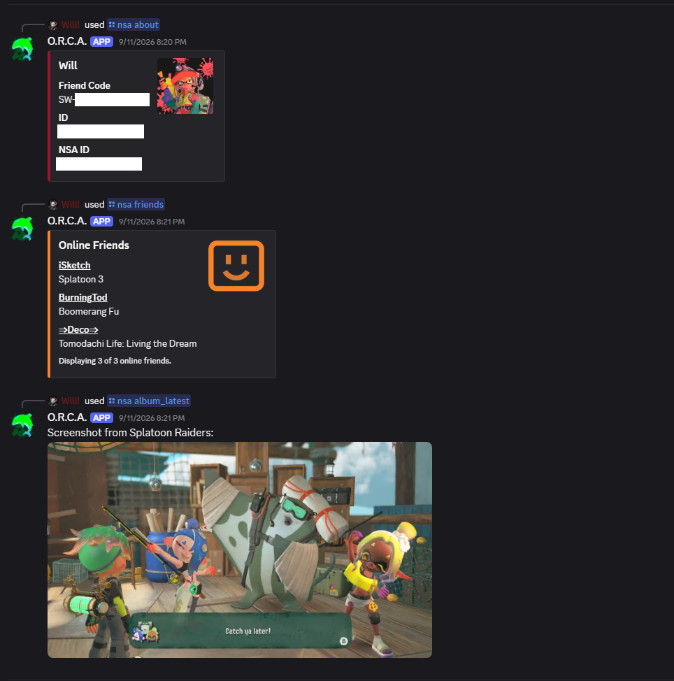

# O.R.C.A. - A companion Nintendo Switch Discord App
This Discord application provides access to Nintendo Switch services from Discord. You can link a Nintendo Account and run commands personalized to your account. You can add it to your Discord applications [here](https://discord.com/users/1389357615489749105).

### App Features
- Account Information
- Album Uploads
- Online Friends
- Playtime Stats
- *More coming soon!*

### Splatoon 3 Features
- *Coming soon!*

## Account Security and Token Management
Nintendo services are accessed with *tokens*. When you sign in, you are granted a *session token*, a special code that is valid for two years (unless revoked) and can be used to verify your identity with Nintendo. Historically, Nintendo has taken issue with projects that store session tokens, but it is the only way to allow commands to be run without signing in every time.

To satify both constraints, ORCA ships with a novel solution: your session tokens are encrypted and stored in your DM channel. They are retrieved and updated per request, but are never stored or logged. This means that ORCA stores no tokens, and the user can revoke access to them at any time by using the sign out command to delete the message, by blocking the app to revoke ORCA's access to the DM channel, or in an extreme case, changing your Nintendo Account password to invalidate all existing session tokens.

If for some reason your Discord account is compromised, bad actors cannot view or steal your tokens because they are encrypted.

Retrieved tokens are processed and sent directly to Nintendo. No token data is stored the server or sent to any other third-party servers. Nintendo requires *attestation tokens* to be present with a login request. These are special tokens that can only be generated by a real Nintendo Switch App. Many community tools make use of the trusted `nxapi-znca-api` for attestation tokens, which provides access to a virturalized app instance. ORCA uses this same process locally on the ORCA server for faster generation speed.

Due to the ongoing cat-and-mouse game with Nintendo over attestation tokens, the library used for app manipulation is omitted from this repository as to not inform them of our current work-around methods.

## Legal Notice & Disclaimer

This project is a non-commercial, fan-made project developed for educational purposes only. 

All title assets, character names, images, graphics, and related sounds are the sole property and registered trademarks of Nintendo Co., Ltd., Nintendo of America Inc., or their respective owners. No copyright infringement is intended. 

This repository is not affiliated with, authorized, endorsed, or sponsored by Nintendo. 
